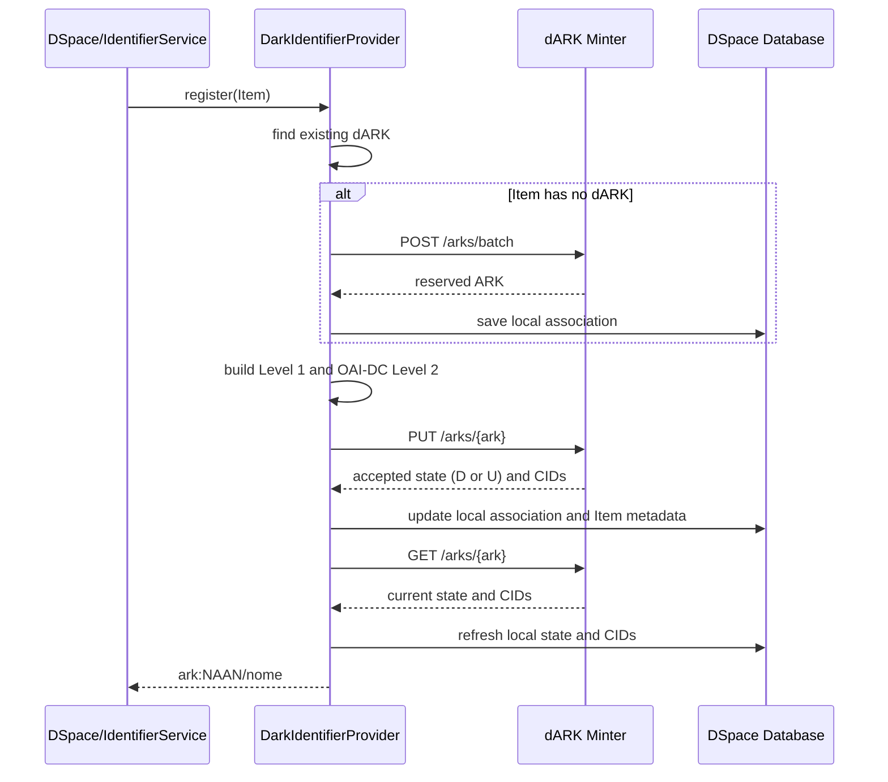

# dARK Integration for DSpace

## Purpose

This implementation adds native support for dARK persistent identifiers to
DSpace. It follows the DSpace identifier provider pattern, preserves the
internal Handle, and integrates the repository only through the dARK Minter
HTTP API. No files in the dARK project are modified by this integration.

dARK identifiers can be assigned automatically to new Items or, for existing
Items, through the `dark` administrative command.

## Components

The integration has five parts:

1. `DarkIdentifierProvider` implements the identifier lifecycle in the DSpace
  `IdentifierService`.
2. `DarkClientImpl` communicates with the dARK Minter API.
3. `DarkMetadataBuilder` transforms Item metadata into API-compatible Level 1
  and OAI-DC Level 2 metadata.
4. `DarkService` and `DarkDAO` persist the local association between an Item
  and a dARK.
5. `dark` assigns dARKs to existing Items idempotently.

## Configuration

The source configuration is in `dspace/config/modules/dark.cfg`. After
installation, the effective configuration is in
`[dspace.dir]/config/modules/dark.cfg`. Update the effective copy and restart
DSpace after changing settings used by the server.

```properties
identifier.dark.enabled = true
identifier.dark.minter-api-url = http://localhost:8001/api/v1
identifier.dark.batch-size = 100
identifier.dark.authority-id = platform-demo-1788435035
identifier.dark.naan = 12345
```

The authority and NAAN must exist and be provisioned in the dARK platform
before the first assignment. The bearer token is optional and is only needed
when the API is protected by HTTP authentication:

```properties
#identifier.dark.api-token =
identifier.dark.authority-header.enabled = true
identifier.dark.authority-header = X-Authority-Id
```

In production, authority identity should use mTLS. The authority header exists
for local profiles in which the Minter accepts it.

### Identifier metadata

```properties
identifier.dark.metadata = dc.identifier.dark
```

The dARK is written only to the field configured in
`identifier.dark.metadata`, in compact form such as `ark:12345/2000000004k`.
It does not replace the Handle, `dc.identifier`, or `dc.identifier.uri`.

### Metadata mapping

The fields accept an ordered, comma-separated list. Every field in the list is
read, rather than only the first one. This supports collections using different
Dublin Core profiles.

```properties
identifier.dark.metadata.title = dc.title
identifier.dark.metadata.creator = dc.creator, dc.contributor.author, dc.contributor
identifier.dark.metadata.date = dc.date, dc.date.issued
identifier.dark.metadata.publisher = dc.publisher
identifier.dark.metadata.type = dc.type
identifier.dark.metadata.language = dc.language.iso
identifier.dark.metadata.abstract = dc.description.abstract
identifier.dark.metadata.subject = dc.subject
```

For Level 1, the Minter requires at least one author and a year with four
digits. With the mapping above, for example, an Item can meet these requirements
using `dc.creator` and `dc.date`, even if it has neither
`dc.contributor.author` nor `dc.date.issued`.

List order determines the order of values sent. It does not limit validation:
the CLI preflight looks for values in every configured field.

## Automatic flow when creating an Item

When `IdentifierService` registers identifiers for an Item,
`DarkIdentifierProvider` participates in the flow if
`identifier.dark.enabled = true`. It ignores objects that are not Items and
makes no external calls while disabled.



DSpace stores the canonical compact form `ark:12345/name`. It accepts the
legacy slash form `ark:/12345/name` at the provider boundary and normalizes it
before persisting, avoiding duplicate local records caused by format
differences.

The payload sent to the Minter contains Level 1 metadata, an alternate
identifier with the Item UUID, the target URL, and an OAI-DC representation for
Level 2. After accepting the `PUT`, the Minter publishes asynchronously. The
provider immediately performs one `GET /arks/{ark}` and persists the most
recent state and CIDs. If it already observes `PUBLISHED` (`P`), the local
association is marked as published. A `DRAFT` (`D`) or `UPDATE` (`U`) response
is valid and does not block Item registration; a temporary read failure is
logged as a warning and does not undo the accepted metadata update.

If required metadata is absent during the automatic flow, the Minter API may
reject the registration. For existing repository content, use the CLI, which
performs preflight before reserving an ARK.

## Command-line assignment

The script is registered as `dark` and requires the provider to be enabled.
Run it from the DSpace installation directory:

```bash
bin/dspace dark --mint-uuid <uuid-do-item>
bin/dspace dark --mint-all
bin/dspace dark --refresh-status
bin/dspace dark --count-local
```

- `--mint-uuid` processes exactly one Item. 
- `--mint-all` queries only Items without a local dARK association, then attempts to mint one for each returned Item. 
- `--count-local` reports the number of Items with a local dARK association without calling the
dARK API or changing data.
- `--refresh-status` queries `GET /arks/{ark}` only for local dARKs in `DRAFT` (`D`) or `UPDATE` (`U`), then persists the returned
state and CIDs. It does not reserve identifiers or submit metadata. The options are mutually exclusive.

For each Item, the command performs this sequence:

1. Checks whether an association already exists in the `dark` table.
2. If one exists, logs `already has dARK` and does not call the Minter.
3. Validates the author and year in the configured fallback fields.
4. If a requirement is missing, logs the Item as `skipped` and does not reserve
  an ARK.
5. If preflight succeeds, `--mint-uuid` delegates reservation and registration to
  `IdentifierService.register`.
6. For `--mint-all`, eligible Items are reserved in batches of
  `identifier.dark.batch-size`, then each Item is registered remotely and
  persisted individually.

At the end of `--mint-all`, the script reports counts for `minted`, `already assigned`,
`skipped for missing metadata`, and `failed`. A failure for one Item does not
stop the traversal; at the end, the command exits with an error if any failure
occurred.

`--refresh-status` uses `identifier.dark.batch-size` to commit local updates
per batch. The dARK API currently exposes status only per ARK, so each batch
still performs one `GET /arks/{ark}` request for each pending ARK. It reports
the number of dARKs checked, published, still pending, and failed. It can be
run repeatedly by an administrator or a cron job until pending records reach
`PUBLISHED`.

Example preflight result for an Item without an author:

```text
Item <uuid> skipped: missing required dARK metadata dc.creator, dc.contributor.author, dc.contributor.
```

The message lists all configured author fields because none contains a usable
value. It does not mean that only the first field was tested.

## Local persistence

The migration creates the sequence and `dark` table. Each row associates an
`Item` with a unique ARK and stores, among other data, its state,
`client_item_id`, target URL, and metadata CIDs. Indexes support lookups by ARK
and DSpace object.

The `dark.status` column stores the dARK Minter state code directly: `R`
(reserved), `D` (draft), `U` (update), `P` (published), or `T` (tombstone).
The local `tombstone_requested` flag is separate from those remote states and is
set only after removal from the Item, until the Minter confirms `T`.

Migrations are provided for PostgreSQL and H2. They must be applied through the
standard DSpace update process before enabling the provider in a new database.

## Deployment and verification

1. Configure `dark.cfg` in the source and effective installation.
2. Run the DSpace database update to apply the `dark` migration.
3. Build and install the DSpace artifact normally.
4. Restart the DSpace server.
5. Test one Item first using `bin/dspace dark --mint-uuid ...`.
6. Only then run `bin/dspace dark --mint-all` for legacy content.

For a focused build during development:

```bash
mvn -pl dspace-api clean package \
  -DskipUnitTests=true -DskipIntegrationTests=true \
  -Dmaven.compiler.useIncrementalCompilation=false
```

Focused unit tests use `-DskipUnitTests=false`, but the environment must have
the `org.dspace:dspace-parent:zip:testEnvironment:11.0-SNAPSHOT` artifact
available locally.

## Safe operation

- Keep `identifier.dark.enabled = false` until the authority, NAAN, and API are
  ready.
- Test with `--mint-uuid` before bulk processing.
- Fix metadata for skipped Items and run the same command again; the flow is
  idempotent for Items that already have a dARK.
- Do not modify the dARK repository or API to adapt DSpace formats; format
  compatibility is handled by the DSpace client.
