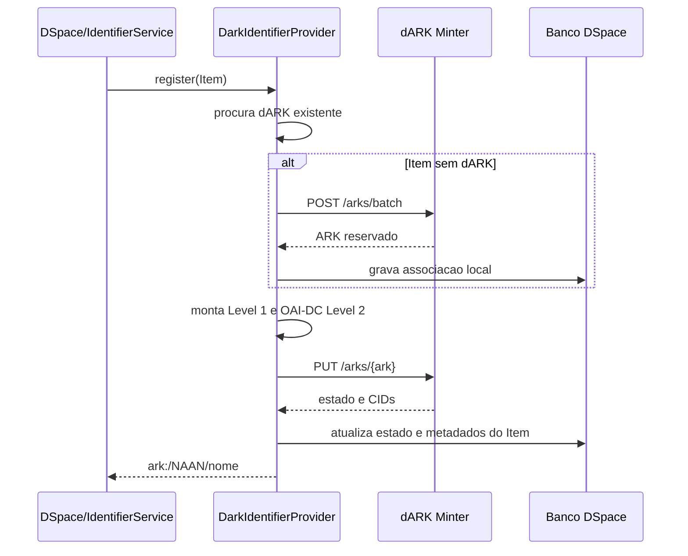

# Integracao dARK no DSpace

## Objetivo

Esta implementacao adiciona suporte nativo ao identificador persistente dARK no
DSpace. Ela segue o padrao de provedores de identificador do DSpace, preserva o
Handle interno e integra o repositorio somente pela API HTTP do minter dARK.
Nenhum arquivo do projeto dARK e alterado por esta integracao.

O dARK pode ser atribuido automaticamente a novos Items ou, para Items ja
existentes, pelo comando administrativo `dark-mint`.

## Componentes

A integracao possui cinco partes:

1. `DarkIdentifierProvider` implementa o ciclo de vida do identificador no
   `IdentifierService` do DSpace.
2. `DarkClientImpl` comunica-se com a API do minter dARK.
3. `DarkMetadataBuilder` transforma os metadados do Item em Level 1 e OAI-DC
   Level 2 aceitos pela API.
4. `DarkService` e `DarkDAO` persistem a associacao local entre Item e dARK.
5. `dark-mint` atribui dARKs a Items existentes de maneira idempotente.

## Configuracao

A configuracao-fonte esta em `dspace/config/modules/dark.cfg`. Depois da
instalacao, a configuracao efetiva fica em `[dspace.dir]/config/modules/dark.cfg`.
Altere a copia efetiva e reinicie o DSpace quando mudar configuracoes usadas pelo
servidor.

```properties
identifier.dark.enabled = true
identifier.dark.minter-api-url = http://localhost:8001/api/v1
identifier.dark.resolver-api-url = http://localhost:8002/api/v1
identifier.dark.authority-id = platform-demo
identifier.dark.naan = 12345
```

A autoridade e o NAAN devem existir e estar provisionados na plataforma dARK
antes da primeira atribuicao. O token bearer e opcional e somente e necessario
quando a API estiver protegida por autenticacao HTTP:

```properties
#identifier.dark.api-token =
identifier.dark.authority-header.enabled = true
identifier.dark.authority-header = X-Authority-Id
```

Em producao, a identidade da autoridade deve preferir mTLS. O cabecalho de
autoridade existe para o perfil local em que o minter o aceita.

### URI publica e metadados do identificador

```properties
identifier.dark.metadata = dc.identifier.dark
identifier.dark.primary-uri.enabled = true
identifier.dark.primary-uri.metadata = dc.identifier.uri
```

O dARK e gravado no campo configurado em `identifier.dark.metadata`. Com
`primary-uri.enabled = true`, o valor de `dc.identifier.uri` e substituido pela
URL do resolver dARK. O Handle continua associado internamente ao Item e ainda e
resolvido pelo DSpace.

### Mapeamento de metadados

Os campos aceitam uma lista ordenada, separada por virgulas. Todos os campos da
lista sao lidos, e nao apenas o primeiro. Isso permite compatibilidade com
colecoes que usam perfis Dublin Core diferentes.

```properties
identifier.dark.metadata.title = dc.title
identifier.dark.metadata.creator = dc.creator, dc.contributor.author, dc.contributor
identifier.dark.metadata.date = dc.date, dc.date.issued
identifier.dark.metadata.publisher = dc.publisher
identifier.dark.metadata.type = dc.type
identifier.dark.metadata.language = dc.language.iso
identifier.dark.metadata.abstract = dc.description.abstract
identifier.dark.metadata.subject = dc.subject
```

Para o Level 1, o minter exige pelo menos um autor e um ano com quatro digitos.
No mapeamento acima, por exemplo, um Item pode satisfazer esses requisitos usando
`dc.creator` e `dc.date`, mesmo que nao possua `dc.contributor.author` ou
`dc.date.issued`.

A ordem da lista determina a ordem dos valores enviados. Ela nao limita a
validacao: o preflight do CLI procura valores em todos os campos configurados.

## Fluxo automatico na criacao de Item

Quando o `IdentifierService` registra identificadores para um Item, o
`DarkIdentifierProvider` participa do fluxo se `identifier.dark.enabled = true`.
Ele ignora objetos que nao sao Items e nao faz chamadas externas quando esta
desabilitado.



O DSpace armazena a forma canonica `ark:/12345/nome`. O minter usa a forma de
caminho `ark:12345/nome`; a conversao ocorre somente na fronteira HTTP. Dessa
forma nao ha registros duplicados locais por diferencas de barra.

O payload enviado ao minter contem metadados Level 1, identificador alternativo
com o UUID do Item, URL de destino e uma representacao OAI-DC para o Level 2.
A resposta atualiza o estado do identificador e os CIDs retornados pelo minter.

Se os metadados obrigatorios estiverem ausentes durante o fluxo automatico, a
API do minter pode rejeitar o registro. Para migracoes de acervo existente, use
o CLI, que executa preflight antes de reservar um ARK.

## Atribuicao por linha de comando

O script e registrado como `dark-mint` e exige que o provider esteja habilitado.
Execute-o no diretorio da instalacao DSpace:

```bash
bin/dspace dark-mint --uuid <uuid-do-item>
bin/dspace dark-mint --all
```

`--uuid` processa exatamente um Item. `--all` percorre todos os Items e tenta
somente os que ainda nao possuem dARK. As opcoes sao mutuamente exclusivas.

Para cada Item, o comando executa esta sequencia:

1. Consulta se ja existe associacao na tabela `dark`.
2. Se existir, registra `already has dARK` e nao chama o minter.
3. Valida autor e ano nos campos de fallback configurados.
4. Se faltar algum requisito, registra o Item como `skipped` e nao reserva ARK.
5. Se o preflight passar, delega a `IdentifierService.register`, que reserva,
   registra remotamente e persiste o resultado.

Ao final de `--all`, o script informa as contagens de `minted`, `already assigned`,
`skipped for missing metadata` e `failed`. Uma falha em um Item nao interrompe a
varredura; ao fim, o comando termina com erro se houve alguma falha.

Exemplo de preflight para um Item sem autor:

```text
Item <uuid> skipped: missing required dARK metadata dc.creator, dc.contributor.author, dc.contributor.
```

A mensagem lista todos os campos de autor configurados porque nenhum deles tinha
um valor utilizavel. Ela nao significa que somente o primeiro campo foi testado.

## Persistencia local

A migracao cria a sequencia e a tabela `dark`. Cada linha associa um `Item` a um
ARK unico e armazena, entre outros dados, estado, `client_item_id`, URL de destino
e CIDs de metadados. Indices protegem consultas por ARK e por objeto DSpace.

As migracoes existem para PostgreSQL e H2. Elas devem ser aplicadas pelo processo
normal de atualizacao do DSpace antes de habilitar o provider em um banco novo.

## Implantacao e verificacao

1. Configure `dark.cfg` na fonte e na instalacao efetiva.
2. Execute a atualizacao de banco do DSpace para aplicar a migracao `dark`.
3. Gere e instale o artefato DSpace normalmente.
4. Reinicie o servidor DSpace.
5. Teste primeiro um unico Item com `bin/dspace dark-mint --uuid ...`.
6. Somente depois execute `bin/dspace dark-mint --all` para o acervo legado.

Para uma compilacao focada durante o desenvolvimento:

```bash
mvn -pl dspace-api clean package \
  -DskipUnitTests=true -DskipIntegrationTests=true \
  -Dmaven.compiler.useIncrementalCompilation=false
```

Os testes unitarios especificos usam `-DskipUnitTests=false`, mas o ambiente
precisa ter o artefato `org.dspace:dspace-parent:zip:testEnvironment:11.0-SNAPSHOT`
disponivel localmente.

## Operacao segura

- Mantenha `identifier.dark.enabled = false` ate a autoridade, o NAAN e a API
  estarem prontos.
- Teste com `--uuid` antes do processamento em lote.
- Corrija metadados dos Items ignorados e execute novamente o mesmo comando;
  o fluxo e idempotente para Items que ja possuem dARK.
- Nao modifique o repositorio ou a API dARK para adaptar formatos do DSpace; a
  compatibilidade de formato e tratada pelo cliente DSpace.
